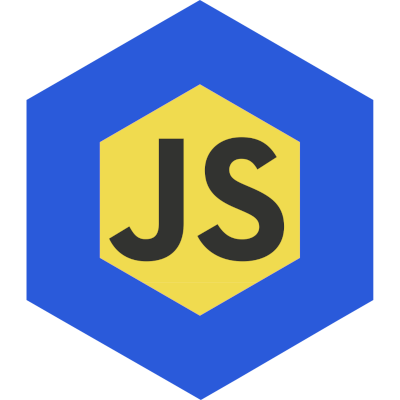

# [Adapter.js](https://adapterjs.link/)

**A Chainlink external adapter for securely executing custom JavaScript**

## Overview

### Problem

Chainlink external adapters are extremely powerful, but have some limitations.

Setting up an external adapter is time consuming.  Developers must first create and host the adapter, then either operate a Chainlink node themselves, or get another node operator to create a  new bridge and job for the adapter.

Additionally, for data received from an external adapter to be truly decentralized, separate instances of the adapter must be hosted on many independent Chainlink nodes.

### Solution

Adapter.js seeks to solve the problems currently facing external adapters by becoming the universal external adapter.  Adapter.js can fetch data from any API or website, then securely process data using custom JavaScript provided by users.  In a Chainlink request to the external adapter, users can provide custom code as a string or reference a JavaScript file hosted on IPFS.

In addition, Adapter.js can securely access web resources which require authentication by allowing users to upload headers containing private keys to the external adapter’s database.  These custom headers are only able to be used in data requests initiated by an approved smart contract address.

Adapter.js is open source and is being developed such that any Chainlink node operator can run their own independent instance of the external adapter.  To achieve decentralization, smart contract developers can then make requests to many nodes which host an instance of the adapter.  Consensus can be reached on-chain by comparing the data provided by each node.

## How to Use Adapter.js

Use the tool at [adapterjs.link/simulator.html](https://adapterjs.link/simulator.html) to simulate making a request to a Chainlink node.  Then, click "Generate Code" to automatically generate the required Solidity code to make the requested call to the external adapter.  Swap out the Chainlink oracle address and job id to make a request to a different Chainlink node which hosts Adapter.js.

## Current Status

Adapter.js is currently hosted on an independent Chainlink node for the Mumbai Polygon testnet.  However, any Chainlink node operator can host the external adapter themselves for any Chainlink-supported blockchain.  As more node operators adopt the external adapter, the list of nodes which host Adapter.js will be updated.

### **Blockchain:** Mumbai
**Oracle Address:** 0x000000
- **Job ID for job which return uint256:** 0x000
- **Job ID for job which return int256:** 0x000
- **Job ID for job which return bool:** 0x000
- **Job ID for job which return bytes32:** 0x000

## Contact

For suggestions and support, please check out the [Adapter.js Discord community!](https://discord.com/invite/jpGx9tMRWa)

